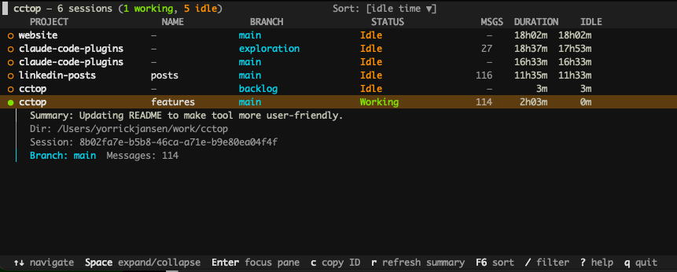

# cctop

A htop-like TUI for monitoring Claude Code sessions in real-time.



See all your running Claude Code sessions at a glance — status, project, branch, idle time, LLM-generated summaries, and more.

**Press `Enter` to jump straight to the iTerm2 pane** running a session. No more hunting through tabs.

## Quick start

```bash
# Run directly (no install needed)
uvx --from claude-cctop@latest cctop

# Install the hooks so cctop can track session activity in real-time
cctop install
```

Restart any running Claude Code sessions after installing hooks.

## iTerm2 integration

Press `Enter` on any session to instantly focus its iTerm2 pane. cctop walks up the process tree from the Claude PID to find the matching terminal session — works across tabs, split panes, and windows.

**Setup:** Make sure the iTerm2 Python API is enabled (Preferences > General > Magic > Enable Python API). It may already be on by default.

## What it shows

| Column   | Description                                    |
|----------|------------------------------------------------|
| PROJECT  | Project directory (auto-detects worktrees)      |
| NAME     | Session name (`--name` flag passed to `claude`) |
| BRANCH   | Git branch or worktree name                     |
| STATUS   | Working (+ current tool), Idle, or Offline      |
| MSGS     | Message count                                   |
| DURATION | Total session duration                          |
| IDLE     | Time since last activity                        |

Expand a session with `Space` to see the PR link, an LLM-generated summary, the working directory, session ID, and branch details.

## Keybindings

| Key       | Action                           |
|-----------|----------------------------------|
| `↑`/`↓` or `k`/`j` | Navigate sessions      |
| `Space`   | Expand / collapse session detail |
| `Enter`   | Focus the iTerm2 pane            |
| `c`       | Copy session ID to clipboard     |
| `r`       | Regenerate LLM summary           |
| `F6` or `>`/`<` | Cycle sort mode            |
| `/`       | Filter (coming soon)             |
| `?` or `h`| Help                             |
| `q`       | Quit                             |

## Options

```
cctop                         # Show active sessions only
cctop --recent 1h             # Include sessions ended within the last hour
cctop install                 # Install hooks into Claude Code settings
cctop uninstall               # Remove hooks and clean up
```

## Requirements

- Python 3.12+
- macOS (iTerm2 integration is macOS-only)
- `jq` (used by hooks — `brew install jq`)
- Claude Code with hooks support

## Uninstall

```bash
cctop uninstall
```

This removes the hooks from Claude Code settings and cleans up `~/.cctop`.
